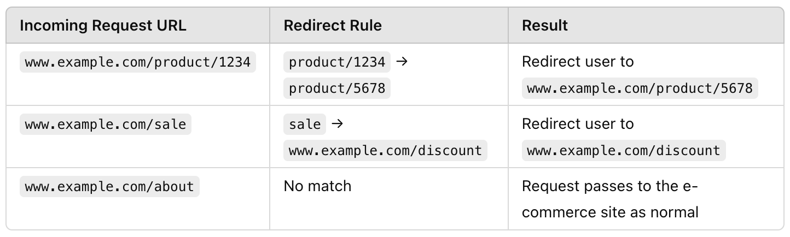
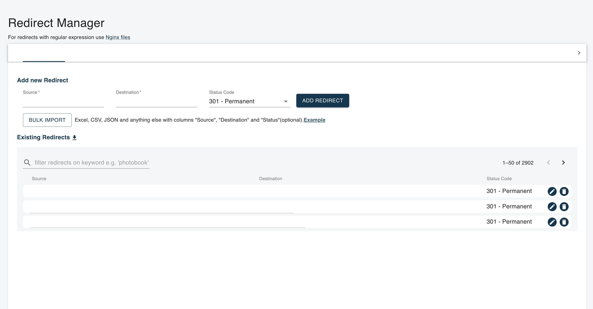

# URL Rewrite Module - TDR & RFC
<!-- For the title I usually like to have a structure like: Technical Design Review - %PROJECT_CATEGORY% -->

## 🔮 Overview 🔮
<!-- Start at the beginning. What problem are you trying to solve? If you jump straight into solutions, it will be hard for people to orient themselves and will inevitably lead to misalignment and misunderstanding. It’s worth spending 2 or 3 sentences to effectively set the context for your spec.

Then, briefly state your proposed solution. This should be enough for most people to decide whether they should continue reading and should be understandable by someone who is not familiar with the project. Between a few sentences and two paragraphs should be enough.-->
The URL Rewrite Module is designed to handle dynamic URL redirection for e-commerce platforms. It allows for flexible, rule-based URL rewriting and redirection that can be configured via a Business Manager interface, supporting both simple and advanced use cases (e.g., site restructuring, product lifecycle management, A/B testing). The module will handle redirections using regular expressions (regex) and ensure the configuration is both scalable and highly performant, supporting features like in-memory caching and logging for analytics.

  

## 💡 Background 💡

<!-- It’s unlikely that writing the design document is the first time you’ve thought about the problem. The background section is an opportunity to bring readers up to speed, and share the context you have on the problem space.

What are the motivations for the project or design? Is there any historical perspective that will help people understand the proposal? Has someone tried to solve the problem in the past? If so, why are those solutions no longer appropriate? Are there any other things going on that will affect the design?-->
Check this document for more context on the solution: https://app.clickup.com/30313665/v/dc/wx361-17315/wx361-52135

  

## 📚 USER REQUIREMENTS 📚
- Site Restructuring: Redirect old URLs to new locations to maintain SEO value and user experience.
- Redirecting discontinued product URLs to replacement products or category pages (Product Lifecycle Management).
- Handling seasonal products.
- Creating short & memorable URLs for marketing campaigns that redirect to specific LPs.
- Brand Consolidation: When merging multiple brands or websites into a single e-commerce platform.
- URL Normalization: redirecting uppercase URLs to lowercase, removing unnecessary parameters or standardizing product URL patterns.
- Typo Correction.
- Geolocation-based Redirects.
- A/B Testing.
- Migrating old e-commerce platform to SFCC.
- Creating easy-to-remember URLs (Vanity URLs) that redirect to more complex URLs.
- Redirecting HTTP to HTTPS for (SSL Enforcement).

  

## ⚓ FEATURES ⚓
- Admin interface for Business Manager to configure redirects.
- Rules storage: Database and JSON so it can be cached by CDN.
- Request handling.
- URL matching by pattern.
- Redirect execution based on rule setup.
- Logging & Analytics using tracke ids.
- Performance optimization via cache.
- Bulk Import/Export via CSV.
- Language-specific redirects for multi-language sites.

  

## ⚙️ Detailed design ⚙️

<!-- What are the user requirements?
What systems will be affected?
What new data structures are needed, what data structures will be changed?
What new APIs will be needed, what APIs will be changed?
What are the efficiency considerations (time/space)?
What are the expected access patterns (load/throughput)?
How will data be validated and what are the potential error states?
Are there any logging, monitoring or observability needs?
Are there any security considerations?
Are there any privacy considerations?
Are there any mobile considerations?
Are there any web-specific considerations?
How will the changes be tested?
How does internationalization and localization — translations, time zones, unicode, etc. — affect your solution? -->

### Architecture

1. **Admin Interface**:
   - Implemented as a **Next.js** application.
   - Allows merchants to manage redirects via a clean, user-friendly interface.
   - Supports CRUD operations, bulk CSV import/export, and validation of regex patterns.

   Since we decoupled the backend from the API from the frontend we can have multiple frontends using the same API endpoints. This means we can integrate this solution into different ecommerces like Shopware or Commerce Tools.

2. **Redirect Rule CRUD APIs**:
   - Expose RESTful APIs for managing redirects:
     - `GET /redirects`: Fetch all redirects.
     - `POST /redirects`: Create a new redirect.
     - `PUT /redirects/{id}`: Update an existing redirect.
     - `DELETE /redirects/{id}`: Remove a redirect.
     - **Bulk Import**: API to upload CSV files with redirect rules.
     - **Bulk Export**: API to download all redirect rules in CSV format.

3. **Backend Storage (DynamoDB)**:
   - A **DynamoDB table** stores each redirect rule.
     - Fields:
       - `regexPattern` (string): The regular expression to match the original URL.
       - `targetUrl` (string): The URL to redirect to.
       - `redirectType` (string): 301 or 302.
       - `active` (boolean): Whether the redirect is currently active.
       - `startDate` (Date, optional): When the redirect starts being active.
       - `endDate` (Date, optional): When the redirect stops being active.
       - `locale` (string, optional): The language/locale for localized redirects.
       - `priority` (integer, optional): The priority for sorting the redirects.
   - Query DynamoDB using regex to find a matching rule for the incoming request.

4. **Request Handling and CDN Integration**: 
   - **Early Intercept**: When an incoming request is received, the system will first check the cache (Redis). If not found, it will query DynamoDB.
   - **CDN-Level Caching**: If the CDN supports the redirect rule, handle it directly at the edge to minimize load on the application server.
   - **Application-Level Redirects**: For more complex or non-cacheable redirects, handle them at the application level using Node.js.

5. **Traffic flow**:
   - **Incoming Request**: A user accesses a URL on the e-commerce site (e.g., www.example.com/product/1234).
   - **Reverse Proxy Handles Request**: The reverse proxy (Nginx, for example) intercepts the incoming request and forwards it to your microservice.
   - **URL Rule Evaluation**: The microservice evaluates the incoming URL against the set of predefined rewrite rules.
    If a match is found (e.g., product/1234 should redirect to product/5678), the microservice returns a redirect response (e.g., HTTP 301 - Permanent Redirect) to the reverse proxy, indicating the new target URL.
   - **Forward to E-commerce Site or Redirect**: If the URL matches a rule, the reverse proxy sends the redirect response back to the user.
    If no match is found, the reverse proxy forwards the original request to the e-commerce site as usual.

    

6. **Logging and Analytics**:
   - Use **structured logging** to capture detailed information about redirects:
     - **Rule ID**: Identifier for the redirect rule.
     - **Matched URL**: The URL being redirected.
     - **Target URL**: The destination URL.
     - **Timestamp**: When the redirect occurred.
   - Store logs in a central logging system (e.g., Elasticsearch, CloudWatch) for real-time analytics and monitoring.
   - **CDN Logging**: If the CDN handles a redirect, logs are not generated by the application.

7. **Failover / Backup**: If the microservice becomes unavailable. Possible strategies include:
   - **Caching**: Cache the rewrite rules locally on the reverse proxy or CDN for a short period of time. This way, if the microservice is down, the rules will still be available for redirection. However, this requires careful cache invalidation to avoid using outdated rules.
   - **Fallback Behavior**: Define fallback behavior for when the microservice is unavailable, such as defaulting to a "No Redirect" action or serving an error page.
    

  

## 🎨 Mockups and wireframes 🎨

  

## 💣 Third-party considerations 💣

<!-- Today it is common to rely on 3rd party platforms to support our development work, whether this be part of AWS or GCP, or a whole separate service. It’s worth thinking through the implications of using a third-party and looking ahead for potential future issues. -->

In this case this solution is ment to be developed using components from AWS or Google Cloud Platform both having a 99.99% uptime and very good reliability.

  

## ⏳ Work estimates ⏳

### Phases

- Phase 1 - Gathering requirements & Analysis: 1 week
- Phase 2 - Solution Design: 1 weeks
- Phase 3 - Development & Integration:  3 weeks
- Phase 4 - Testing: 1 week
- Phase 5 - Deployment & Monitoring: 2 weeks

**Delivery in 8 weeks**

### Team

- UX/UI (10 FTE): 1 x 2 weeks (Phase 1 and Phase 2)
- Fullstack Developer (40 FTE):  1 x 8 weeks dedicated to Rule Manager backoffice & CRUD. 
- Backend Developer & DevOps (40 FTE): 1 x 8 weeks dedicated to Infra & Microservice.

**Cost: 90 FTE**

## 🚀 Roll-out plan 🚀

WiP

  

## 🤖 Tech Stack 🤖

- [AWS / GCP]().
- [Node]().
- [NextJS]().
- [CDN]().
- [Relational DDBB]().

  