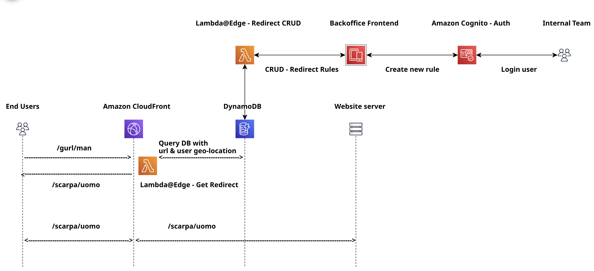

# URL Rewrite Module - TDR & RFC
<!-- For the title I usually like to have a structure like: Technical Design Review - %PROJECT_CATEGORY% -->

## 🔮 Overview 🔮
<!-- Start at the beginning. What problem are you trying to solve? If you jump straight into solutions, it will be hard for people to orient themselves and will inevitably lead to misalignment and misunderstanding. It’s worth spending 2 or 3 sentences to effectively set the context for your spec.

Then, briefly state your proposed solution. This should be enough for most people to decide whether they should continue reading and should be understandable by someone who is not familiar with the project. Between a few sentences and two paragraphs should be enough.-->
The URL Rewrite Module is designed to handle dynamic URL redirection for e-commerce platforms. It allows for flexible, rule-based URL rewriting and redirection that can be configured via a Business Manager interface, supporting both simple and advanced use cases (e.g., site restructuring, product lifecycle management, A/B testing). The module will handle redirections using regular expressions (regex) and ensure the configuration is both scalable and highly performant, supporting features like in-memory caching and logging for analytics.

  

## 💡 Background 💡

<!-- It’s unlikely that writing the design document is the first time you’ve thought about the problem. The background section is an opportunity to bring readers up to speed, and share the context you have on the problem space.

What are the motivations for the project or design? Is there any historical perspective that will help people understand the proposal? Has someone tried to solve the problem in the past? If so, why are those solutions no longer appropriate? Are there any other things going on that will affect the design?-->
Check this document for more context on the solution: https://app.clickup.com/30313665/v/dc/wx361-17315/wx361-52135

  

## ⚓ Goals, non-goals, and future goals ⚓

  

### ✅ Goals ✅

<!-- In order to build alignment and communicate a definition of done, it is important to clearly articulate the goals of this work. The best goals are simple, truthy sentences that describe a future state of the world. Unlike an OKR, it’s fine for these goals to be hyper-specific. Projects will often have 3-5 goals. -->

  

### ❌ Non Goals ❌

<!-- As well as explaining what you want to achieve, it is equally important to say what you are explicitly not addressing. These can sometimes be hard to identify, but imagine what another person might expect to be coupled with this work. -->

  

### 🤞🏻  Future Goals 🤞🏻

<!-- Future goals are an opportunity to list things you want to do in the future, but have descoped for this phase of the project. In other words, these are things you want to make sure your solution doesn’t accidentally make difficult or 
impossible. -->

  

## ⚙️ Detailed design ⚙️

<!-- What are the user requirements?
What systems will be affected?
What new data structures are needed, what data structures will be changed?
What new APIs will be needed, what APIs will be changed?
What are the efficiency considerations (time/space)?
What are the expected access patterns (load/throughput)?
How will data be validated and what are the potential error states?
Are there any logging, monitoring or observability needs?
Are there any security considerations?
Are there any privacy considerations?
Are there any mobile considerations?
Are there any web-specific considerations?
How will the changes be tested?
How does internationalization and localization — translations, time zones, unicode, etc. — affect your solution? -->

### USER REQUIREMENTS
- Site Restructuring: Redirect old URLs to new locations to maintain SEO value and user experience.
- Redirecting discontinued product URLs to replacement products or category pages (Product Lifecycle Management).
- Handling seasonal products.
- Creating short & memorable URLs for marketing campaigns that redirect to specific LPs.
- Brand Consolidation: When merging multiple brands or websites into a single e-commerce platform.
- URL Normalization: redirecting uppercase URLs to lowercase, removing unnecessary parameters or standardizing product URL patterns.
- Typo Correction.
- Geolocation-based Redirects.
- A/B Testing.
- Migrating old e-commerce platform to SFCC.
- Creating easy-to-remember URLs (Vanity URLs) that redirect to more complex URLs.
- Redirecting HTTP to HTTPS for (SSL Enforcement).

### FEATURES
- Admin interface for Business Manager to configure redirects.
- Rules storage: Database and JSON so it can be cached by CDN.
- Request handling.
- URL matching by pattern.
- Redirect execution based on rule setup.
- Logging & Analytics using tracke ids.
- Performance optimization via cache.
- Bulk Import/Export via CSV.
- Language-specific redirects for multi-language sites.

  

## 🎨 Mockups and wireframes 🎨

  

## 💣 Third-party considerations 💣

<!-- Today it is common to rely on 3rd party platforms to support our development work, whether this be part of AWS or GCP, or a whole separate service. It’s worth thinking through the implications of using a third-party and looking ahead for potential future issues. -->

  

## 

## ⏳ Work estimates ⏳

- Phase 1: Requirements Gathering & Analysis – 1 week
- Phase 2: Solution Design – 2 weeks
- Phase 3: Development & Integration – 4–6 weeks
- Phase 4: Testing – 1 week
- Phase 5: Deployment & Monitoring – 1-2 weeks
- Phase 6: Post-Launch & Maintenance – Review 1 month later

Total: 9-12 weeks

  

## 🚀 Roll-out plan 🚀

  

## 🎢 Alternative approaches 🎢

  

## 🤖 Tech Stack 🤖

- .
- .
- .
- .

  

## 📚 Resources 📚

<!-- MARKDOWN LINKS & IMAGES -->
<!-- https://www.markdownguide.org/basic-syntax/#reference-style-links -->
[contributors-shield]: https://img.shields.io/github/contributors/RaulCatedra3003/Local-FileSystem-explorer.svg?style=flat-square
[contributors-url]: https://github.com/RaulCatedra3003/Local-FileSystem-explorer/graphs/contributors
[forks-shield]: https://img.shields.io/github/forks/RaulCatedra3003/Local-FileSystem-explorer.svg?style=flat-square
[forks-url]: https://github.com/RaulCatedra3003/Local-FileSystem-explorer/network/members
[stars-shield]: https://img.shields.io/github/stars/RaulCatedra3003/Local-FileSystem-explorer.svg?style=flat-square
[stars-url]: https://github.com/RaulCatedra3003/Local-FileSystem-explorer/stargazers
[issues-shield]: https://img.shields.io/github/issues/RaulCatedra3003/Local-FileSystem-explorer.svg?style=flat-square
[issues-url]: https://github.com/RaulCatedra3003/Local-FileSystem-explorer/issues
[license-shield]: https://img.shields.io/github/license/RaulCatedra3003/Local-FileSystem-explorer.svg?style=flat-square
[license-url]: https://github.com/RaulCatedra3003/Local-FileSystem-explorer/blob/master/LICENSE.txt
[linkedin-shield]: https://img.shields.io/badge/-LinkedIn-black.svg?style=flat-square&logo=linkedin&colorB=555